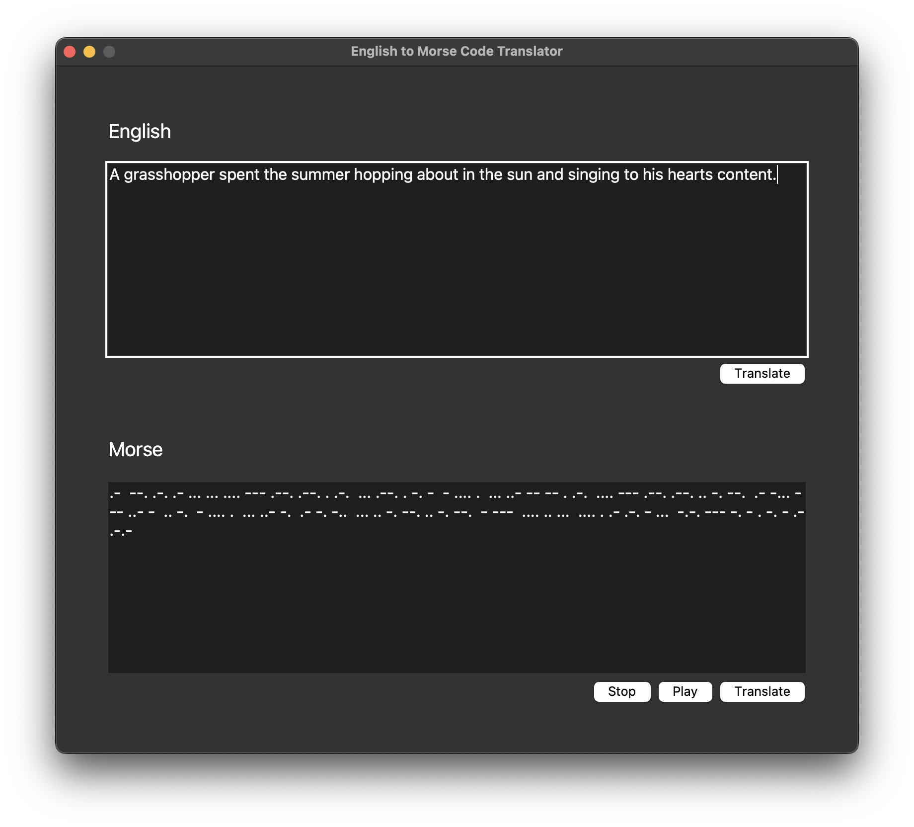

# English to Morse Code Translator
Python application to encode and decode Morse code into English text.

## About

It's a simple python application made with [Tkinter](http://tkdocs.com) that enables encoding English to Morse code and decoding Morse code to English. You can also play the sound of the Morse code thanks to the use of multithreading and the [playsound](https://github.com/TaylorSMarks/playsound) library.